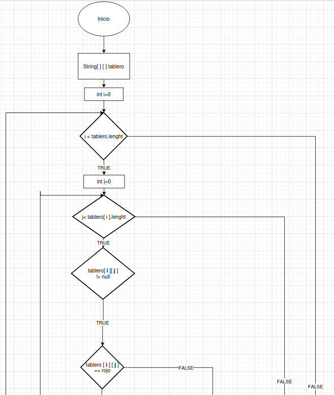
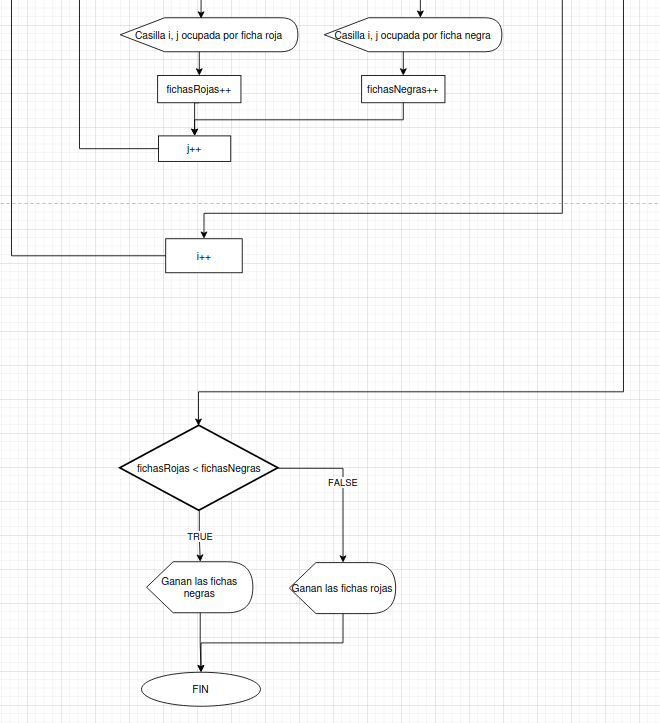

# Examen 1ª Evaluación

---

Explica a continación cada apartado del examen

Con cada apartado realiza un commit diferente 


## Apartado 1  

---
### Diagrama de Flujo de las Damas  



## Apartado 2

---

### Tipo de tablero

```
String[][] tablero={
    {null,"rojo",null,"rojo",null,"rojo",null,"rojo"},
    {"rojo",null,"rojo",null,"rojo",null,"rojo",null},
    {null,"rojo",null,"rojo",null,"rojo",null,"rojo"},
    {null,null,null,null,null,null,null,null},
    {null,null,null,null,null,null,null,null},
    {"negro",null,"negro",null,"negro",null,"negro",null},
    {null,"negro",null,"negro",null,"negro",null,"negro"},
    {"negro",null,"negro",null,"negro",null,"negro",null},
};
```
**El tablero consta de dos colores, *rojo* y *negro***
, las fichas cada vez que avanzan una fila se desplazan una
posicion hacia la izquierda o derecha
porque se mueven en diagonales.
